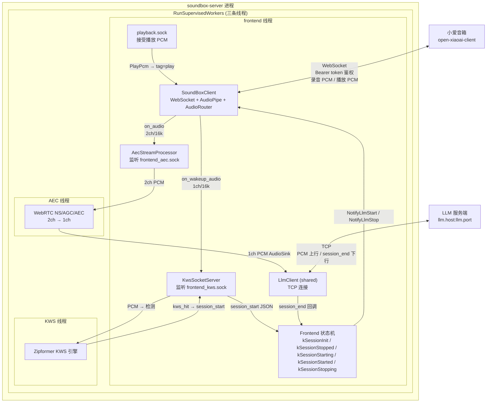
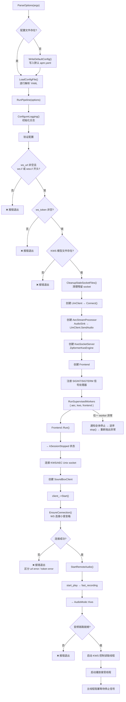
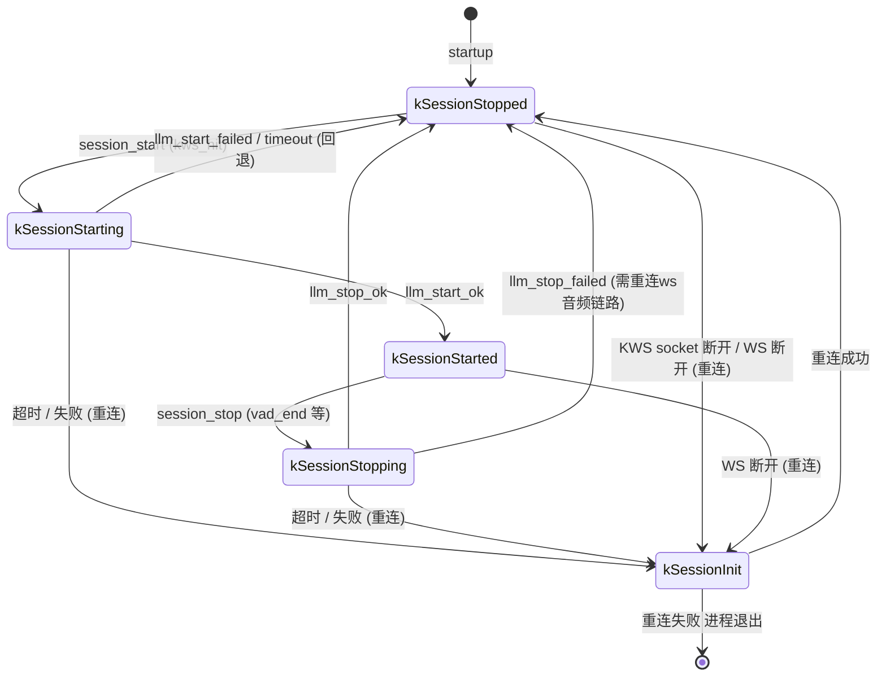
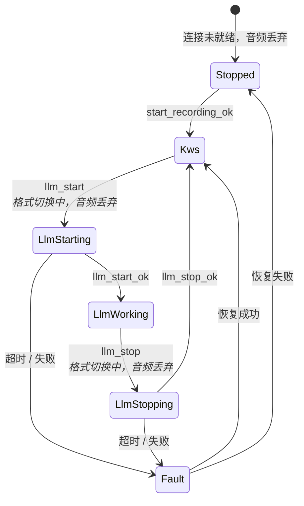
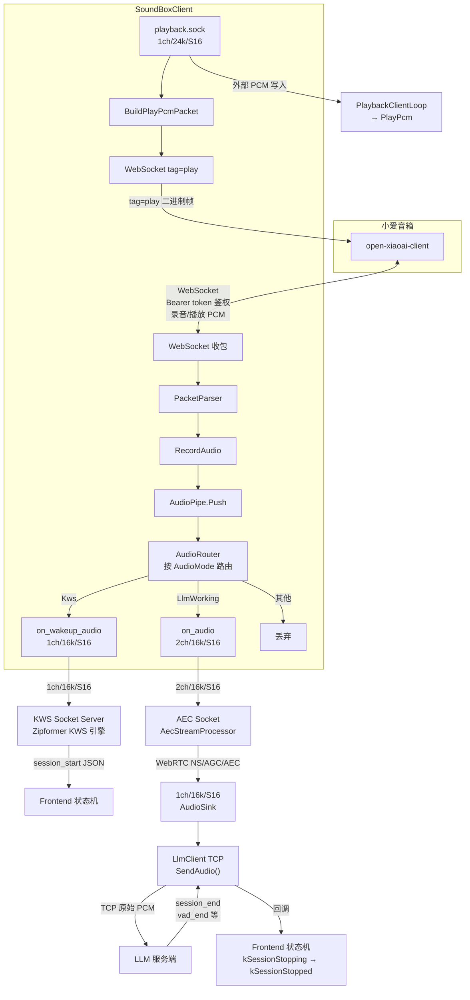

# soundbox-server

`soundbox-server` 是小爱音箱实时音频通路的本地服务。

## 整体架构流程

1. 小爱 WebSocket 音频 → frontend → KWS
2. KWS 命中后 → session_start → llm_start → AEC → LlmClient(TCP) → LLM 服务端（VAD）
3. LLM 服务端（VAD）end 后 → session_end 回调 → llm_stop → 回到 KWS



播放 PCM 数据也可以通过 `frontend_playback.sock` 写出；frontend 会将其封装为 `tag=play` 的 WebSocket 二进制负载发送给小爱音箱。

## 主进程启动流程



## Frontend 状态机



状态转换规则：

| 当前状态 | 事件 | 目标状态 | 说明 |
|---------|------|---------|------|
| kSessionStopped | startup | kSessionStopped | Frontend 启动进入空闲状态 |
| kSessionStopped | session_start (kws_hit) | kSessionStarting | KWS 唤醒命中 |
| kSessionStarting | llm_start_ok | kSessionStarted | SoundBox 切换到 LLM raw 模式成功 |
| kSessionStarting | llm_start_failed/timeout | kSessionStopped | 切换失败，回退等待下一次唤醒 |
| kSessionStarted | session_stop (vad_end) | kSessionStopping | LLM 会话结束 |
| kSessionStopping | llm_stop_ok | kSessionStopped | SoundBox 切回 KWS 模式成功 |
| kSessionStopping | llm_stop_failed | kSessionStopped | 停止失败仍回到空闲，需重连ws音频链路 |
| 任意 | AEC/KWS socket 断开 / WS 断开 | kSessionInit | 重连ws音频链路 |

## SoundBox 音频路由状态机 (AudioMode)



AudioMode 路由策略：

| AudioMode | 音频去向 | 格式 |
|-----------|---------|------|
| Stopped | 丢弃 | — |
| Kws | `on_wakeup_audio` → KWS socket | 1ch / 16k / S16 |
| LlmStarting | 丢弃 | 切换窗口，格式不确定 |
| LlmWorking | `on_audio` → AEC socket | 2ch / 16k / S16 |
| LlmStopping | 丢弃 | 切换窗口，格式不确定 |
| Fault | 丢弃 | — |

## 音频数据流转图



## 编译构建

```sh
cmake -S . -B .
cmake --build .
ctest --output-on-failure
```

构建过程会从 `third_party/archives` 中准备并集成以下内置依赖：WebRTC APM、ixwebsocket、nlohmann_json、spdlog 和 sherpa-onnx。

## 运行指南

首先编辑 `apm.yaml` 配置文件（完整示例）：

```yaml
socket_dir: "/tmp/soundbox-server"

soundbox:
  ws_url: "ws://192.168.0.50:4399/"
  ws_token: "listen-code-from-open-xiaoai-client"
  connect_timeout_ms: 10000
  llm_start_timeout_ms: 1000
  llm_stop_timeout_ms: 1000

wakeup:
  say_hello: "在"
  keywords_file: "assets/keywords.txt"
  tokens_path: "assets/tokens.txt"
  encoder_path: "assets/encoder.onnx"
  decoder_path: "assets/decoder.onnx"
  joiner_path: "assets/joiner.onnx"
  kws_threshold: 0.20
  kws_score: 3.0
  kws_num_threads: 2
  kws_max_active_paths: 8
  kws_num_trailing_blanks: 0
  min_trigger_interval_ms: 800

playback:
  sample_rate: 24000
  channels: 1
  bits_per_sample: 16

llm:
  host: "127.0.0.1"
  port: 7799

aec:
  delay_ms: 2
  pre_aec_auto_gain:
    enabled: true
    target_rms: 2400
    max_gain: 6.0
    attack: 1.0
    release: 1.0
  ns_level: high
  agc_mode: adaptive-digital
  agc_target_dbfs: 3
  agc_compression_gain_db: 9
  agc_limiter_enabled: true

budget:
  input_queue_frames: 64
  output_queue_frames: 128
  reconnect_backoff_min_ms: 300
  reconnect_backoff_max_ms: 4000

log:
  enable_debug: true
  file_enabled: true
  file_path: "logs/soundbox_server.log"
```

然后启动服务：

```sh
./soundbox-server --config apm.yaml
```

生产环境启动时不需要 `--input` 参数。如果 `soundbox.ws_url` 或 `soundbox.ws_token` 缺失或配置错误，服务会在启动时报错退出。

## open-xiaoai-client 前置要求

需要以监听模式启动 `open-xiaoai-client`，并将生成的监听码（listen code）填入 `soundbox.ws_token`。同时需要将音箱的 WebSocket 地址填入 `soundbox.ws_url`（格式必须为 `ws://` 或 `wss://` 开头）。

```sh
open-xiaoai-client -l
```

示例配置：

```yaml
soundbox:
  ws_url: "ws://192.168.0.50:4399/"
  ws_token: "whsn1oeo"
```

## LLM 服务端前置要求

需要有一个独立的 LLM 服务端运行在 `llm.host:llm.port` 指定的地址上（默认为 `127.0.0.1:7799`）。LLM 服务端通过 TCP 接收经过 AEC 处理后的音频数据（1ch/S16_LE/16kHz），并在会话需要结束时发送 `session_end` JSON 行：

```json
{"type":"session_end","reason":"vad_end","timestamp_ms":123456}
```

## 各模式音频格式

KWS 模式：
```text
1ch / S16_LE / 16000 Hz
```

AEC 模式：
```text
2ch / S16_LE / 16000 Hz / 交错排列
声道0 = 近端 / 麦克风
声道1 = 播放参考信号
```

AEC 处理后输出至 LLM 服务端：
```text
1ch / S16_LE / 16000 Hz，通过 TCP 发送原始 PCM
```

播放 Socket 输入：
```text
1ch / S16_LE / 24000 Hz
```

## 本地 Socket 路径及职责

以 `socket_dir: "/tmp/soundbox-server"` 配置为例：

```text
/tmp/soundbox-server/frontend_kws.sock
  frontend -> KWS：1ch/16k/S16 PCM
  KWS -> frontend：session_start JSON 行

/tmp/soundbox-server/frontend_aec.sock
  frontend -> AEC：2ch/16k/S16 PCM

/tmp/soundbox-server/frontend_playback.sock
  模拟播放/LLM -> frontend：播放 PCM 数据
```

所有监听 Socket 均为单客户端模式。当前客户端断开连接后，监听器会回到 `accept()` 状态等待下一个客户端接入。

## AEC 输出路径

AEC 处理后的音频（1ch / S16_LE / 16000 Hz）通过 TCP 发送给 `llm.host:llm.port` 配置的 LLM 服务端，不会写入本地 WAV 文件。LLM 服务端可自行决定是否将收到的音频留存为文件。

单元测试中，AEC 输出通过 `FileRecorder` 写入本地 WAV 文件，用于 MD5 回归校验（见下方 AEC MD5 测试一节）。测试 WAV 默认输出至项目 fixtures 目录：

```text
tests/fixtures/aec_processed.wav
```

## 会话控制协议

KWS 命中时发送的 `session_start`：
```json
{"type":"session_start","reason":"kws_hit","score":0,"timestamp_ms":123456}
```

LLM 服务端（通过 TCP）发送的 `session_end`：
```json
{"type":"session_end","reason":"vad_end","timestamp_ms":123456}
```

frontend 仅在 kSessionStopped 状态下接受 `session_start`。在其他状态下收到的重复 `session_start` 消息会被记录日志并忽略。`session_end` 从 LLM TCP 服务端接收（而非 AEC Socket），且仅在 kSessionStarted 状态下接受。

## AEC MD5 测试

文件型 frontend 和 FileRecorder 仅为测试工具，源代码位于：

```text
tests/aec/file_audio_stream_frontend.cpp
tests/aec/file_audio_stream_frontend.hpp
tests/aec/file_recorder.cpp
tests/aec/file_recorder.hpp
```

AEC 回归测试固件：

```text
tests/fixtures/aec_2ch_16k.s16
tests/fixtures/expected_aec_processed.md5
```

AEC MD5 测试通过 AudioSink 回调连接到测试用的 FileRecorder Socket：

```text
FileAudioStreamFrontend -> AEC（AudioSink -> FileRecorder WAV）-> MD5
```

运行测试：
```sh
ctest --output-on-failure
```

如果 WebRTC APM 的代码或参数有意发生了变更，需要从新的 WAV 输出重新生成 `expected_aec_processed.md5`，并记录变更原因。

## Mock Soundbox 烟雾测试

`audio_processing_module_tests` 会在进程内启动一个模拟的小爱 WebSocket 服务端、伪造的 KWS/AEC Unix Socket，以及一个模拟的 LLM TCP 服务端。烟雾测试验证以下完整通路：

```text
frontend websocket 连接
  -> start_play
  -> fast_recording
  -> KWS 录音 PCM 路由至 frontend_kws.sock
  -> session_start
  -> llm_start
  -> AEC 录音 PCM 路由至 frontend_aec.sock
  -> 经 AEC 处理后的音频发送至模拟 LLM TCP 服务端
  -> 模拟 LLM TCP 服务端发送 session_end
  -> llm_stop
  -> 播放 PCM 以 websocket tag=play 转发
```

使用常规测试命令运行：
```sh
ctest --output-on-failure
```

## 常见故障排查

`missing or invalid config: soundbox.ws_url`
- 在 `apm.yaml` 中设置 `soundbox.ws_url` 字段，格式必须为 `ws://` 或 `wss://` 开头。

`missing or invalid config: soundbox.ws_token`
- 运行 `open-xiaoai-client -l`，将输出的监听码填入 `soundbox.ws_token` 字段。

`missing required KWS asset`
- 检查 `assets/keywords.txt`、`assets/tokens.txt`、`assets/encoder.onnx`、`assets/decoder.onnx` 和 `assets/joiner.onnx` 这些文件是否存在，或在 `apm.yaml` 中更新 `wakeup` 相关路径。

`llm_start` 或 `llm_stop` 超时
- 检查小爱 WebSocket 连接、token 以及客户端日志。在启动/停止切换期间，frontend 会丢弃传入的录音音频，以避免 KWS 和 AEC 两种格式混用。

WebSocket 连接失败（启动时报错退出）
- URL 错误：检查 `soundbox.ws_url` 是否指向正确的音箱地址和端口，确保音箱端 `open-xiaoai-client` 已在监听模式下运行。错误信息中包含 "url error" 表示 URL 不可达或格式有误。
- Token 错误：检查 `soundbox.ws_token` 是否与 `open-xiaoai-client -l` 输出的监听码一致。错误信息中包含 "token error" 或 HTTP 401/403 表示认证失败。

LLM TCP 连接失败
- 确认 LLM 服务端正在 `llm.host:llm.port`（默认 `127.0.0.1:7799`）上运行。LlmClient 会以 10 秒总超时时间重试 TCP 连接。

Socket 连接失败
- 删除 `socket_dir` 目录下的残留 Socket 文件，或重启服务。服务启动时会自动清理残留的 Socket 文件。