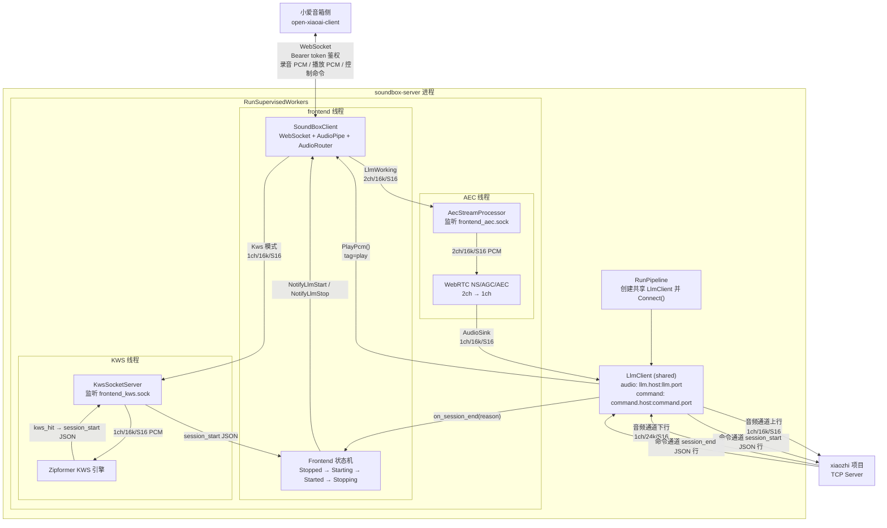
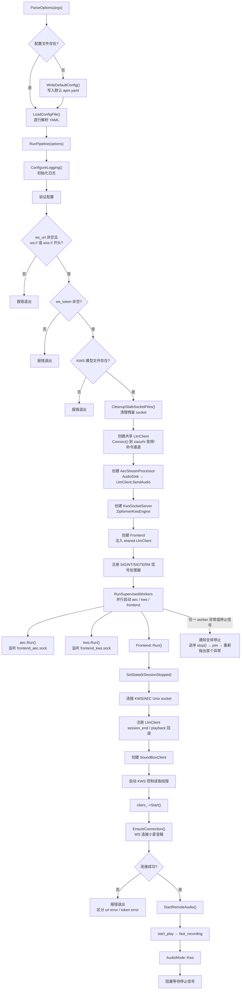
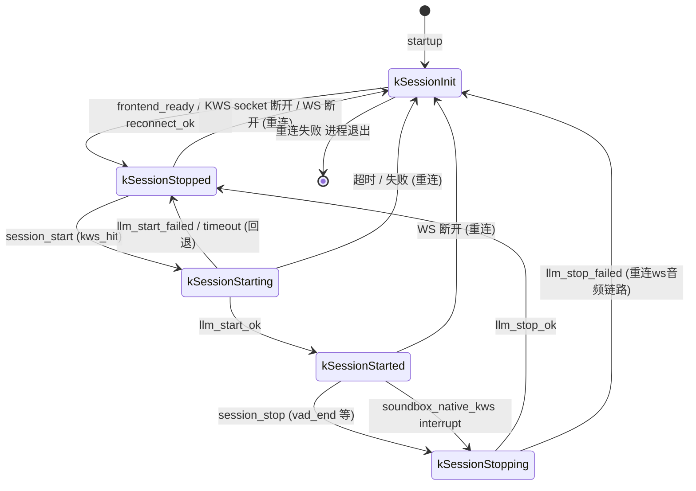
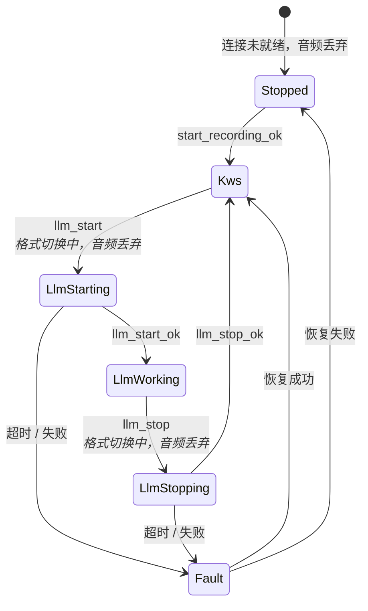
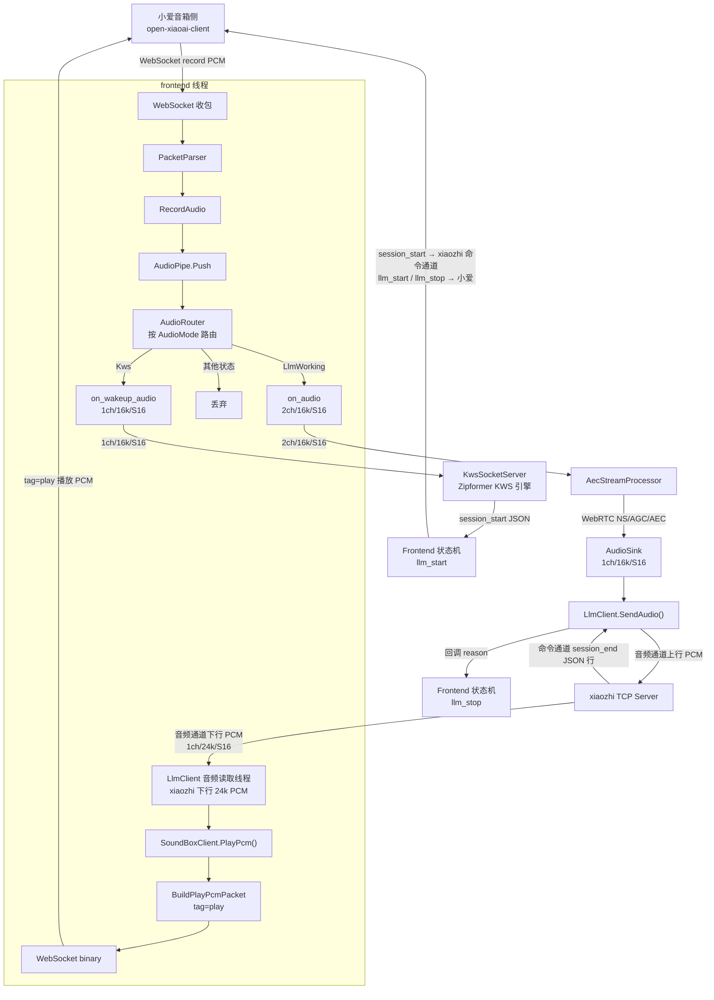

# soundbox-server

`soundbox-server` 是小爱音箱实时音频通路的本地服务。

## 整体架构流程

1. 小爱 WebSocket 音频 → frontend → KWS
2. KWS 命中后 → 进入 kSessionStarting → xiaozhi 命令通道发送 session_start → llm_start → AEC → xiaozhi 音频通道
3. xiaozhi 命令通道返回 session_end → llm_stop → 回到 KWS；音频通道下行 24k PCM 直接播放



xiaozhi 音频通道下行 PCM 固定为 `16bit / 24kHz / 1ch`，frontend 会将其封装为 `tag=play` 的 WebSocket 二进制负载发送给小爱音箱。

## 主进程启动流程



## Frontend 状态机



Frontend 状态机采用单线程事件队列串行流转：KWS 控制线程、xiaozhi 命令线程、SoundBox WS 回调线程都只投递控制事件，不直接修改 `state_`。高频音频数据不进入事件队列，只读取由状态机设置的 atomic 门控开关。

状态转换规则：

| 当前状态 | 事件 | 目标状态 | 说明 |
|---------|------|---------|------|
| kSessionInit | frontend_ready / reconnect_ok | kSessionStopped | SoundBox 链路与本地 socket 就绪，进入空闲状态 |
| kSessionStopped | session_start (kws_hit) | kSessionStarting | KWS 唤醒命中 |
| kSessionStarting | xiaozhi session_start 已发送且 llm_start_ok | kSessionStarted | xiaozhi 会话启动，SoundBox 切换到 LLM raw 模式成功 |
| kSessionStarting | soundbox_native_kws | 队列中等待 | 状态机正在处理启动事件，不插队；启动完成进入 kSessionStarted 后再处理该事件并立刻停止 |
| kSessionStarting | llm_start_failed/timeout | kSessionStopped | 切换失败，回退等待下一次唤醒 |
| kSessionStarted | session_stop (vad_end) | kSessionStopping | xiaozhi 会话结束 |
| kSessionStarted | soundbox_native_kws | kSessionStopping | SoundBox 原生 KWS 打断当前会话，向 xiaozhi 发送 {"type":"session_end","reason":"soundbox_native_kws","source":"soundbox"} 后触发本地 session_stop |
| kSessionStopping | llm_stop_ok | kSessionStopped | SoundBox 切回 KWS 模式成功 |
| kSessionStopping | llm_stop_failed | kSessionInit | 停止失败进入重连流程 |
| 任意 | AEC/KWS socket 断开 / WS 断开 | kSessionInit | 重连ws音频链路 |

## SoundBox 音频路由状态机 (AudioMode)



AudioMode 路由策略：

| AudioMode | 音频去向 | 格式 |
|-----------|---------|------|
| Stopped | 丢弃 | — |
| Kws | `on_wakeup_audio` → KWS socket | 1ch / 16k / S16 |
| LlmStarting | 丢弃 | 切换窗口，格式不确定 |
| LlmWorking | `on_audio` → AEC socket | 2ch / 16k / S16 |
| LlmStopping | 丢弃 | 切换窗口，格式不确定 |
| Fault | 丢弃 | — |

## 音频数据流转图



## 编译构建

```sh
cmake -S . -B .
cmake --build .
ctest --output-on-failure
```

构建过程会优先从 `third_party/archives` 中准备并集成以下内置依赖：WebRTC APM、ixwebsocket、nlohmann_json、spdlog 和 sherpa-onnx。若某个源码包在 `third_party/archives` 中不存在，构建脚本才会根据 `third_party/downloads` 中记录的 URL 下载，并缓存回 `third_party/archives`。

## 运行指南

首先编辑 `apm.yaml` 配置文件（完整示例）：

```yaml
socket_dir: "/tmp/soundbox-server"

soundbox:
  ws_url: "ws://192.168.0.50:4399/"
  ws_token: "listen-code-from-open-xiaoai-client"
  connect_timeout_ms: 10000
  llm_start_timeout_ms: 1000
  llm_stop_timeout_ms: 1000

wakeup:
  say_hello: "在"
  keywords_file: "assets/keywords.txt"
  tokens_path: "assets/tokens.txt"
  encoder_path: "assets/encoder.onnx"
  decoder_path: "assets/decoder.onnx"
  joiner_path: "assets/joiner.onnx"
  kws_threshold: 0.20
  kws_score: 3.0
  kws_num_threads: 2
  kws_max_active_paths: 8
  kws_num_trailing_blanks: 0
  min_trigger_interval_ms: 800

command:
  host: "127.0.0.1"
  port: 7789

llm:
  host: "127.0.0.1"
  port: 7799

aec:
  delay_ms: 2
  pre_aec_auto_gain:
    enabled: true
    target_rms: 2400
    max_gain: 6.0
    attack: 1.0
    release: 1.0
  ns_level: high
  agc_mode: adaptive-digital
  agc_target_dbfs: 3
  agc_compression_gain_db: 9
  agc_limiter_enabled: true

budget:
  input_queue_frames: 64
  output_queue_frames: 128
  reconnect_backoff_min_ms: 300
  reconnect_backoff_max_ms: 4000

log:
  enable_debug: true
  file_enabled: true
  file_path: "logs/soundbox_server.log"
```

然后启动服务：

```sh
./soundbox-server --config apm.yaml
```

生产环境启动时不需要 `--input` 参数。如果 `soundbox.ws_url` 或 `soundbox.ws_token` 缺失或配置错误，服务会在启动时报错退出。

## open-xiaoai-client 前置要求

需要以监听模式启动 `open-xiaoai-client`，并将生成的监听码（listen code）填入 `soundbox.ws_token`。同时需要将音箱的 WebSocket 地址填入 `soundbox.ws_url`（格式必须为 `ws://` 或 `wss://` 开头）。

```sh
open-xiaoai-client -l
```

示例配置：

```yaml
soundbox:
  ws_url: "ws://192.168.0.50:4399/"
  ws_token: "whsn1oeo"
```

## xiaozhi 前置要求

需要有一个独立的 xiaozhi TCP Server：音频通道监听 `llm.host:llm.port`（默认 `127.0.0.1:7799`），命令通道监听 `command.host:command.port`（默认 `127.0.0.1:7789`）。soundbox-server 会作为 TCP Client 主动连接两个通道。

命令通道使用 JSON 行协议，KWS 命中后 soundbox-server 会发送 `session_start`；xiaozhi 需要结束会话时发送 `session_end`：

```json
{"type":"session_end","reason":"vad_end","timestamp_ms":123456}
```

## 各模式音频格式

KWS 模式：
```text
1ch / S16_LE / 16000 Hz
```

AEC 模式：
```text
2ch / S16_LE / 16000 Hz / 交错排列
声道0 = 近端 / 麦克风
声道1 = 播放参考信号
```

AEC 处理后输出至 xiaozhi 音频通道：
```text
1ch / S16_LE / 16000 Hz，通过 TCP 发送原始 PCM
```

xiaozhi 音频通道下行播放音频：
```text
1ch / S16_LE / 24000 Hz，固定格式，不从 YAML 配置
```

## 本地 Socket 与 xiaozhi TCP 通道

以 `socket_dir: "/tmp/soundbox-server"` 配置为例：

| 接口 | 监听方（服务端） | 连接方（客户端） | 数据方向 | 数据格式 |
|---|---|---|---|---|
| `frontend_kws.sock` | KwsSocketServer（KWS 线程） | Frontend（frontend 线程） | 双向：frontend → KWS 写入 PCM；KWS → frontend 回写 session_start JSON | PCM: 1ch/16k/S16；JSON: `{"type":"session_start",...}` |
| `frontend_aec.sock` | AecStreamProcessor（AEC 线程） | Frontend（frontend 线程） | 单向：frontend → AEC 写入 PCM | 2ch/16k/S16 |

soundbox-server 进程会主动连接以下外部服务：

| 连接目标 | 协议 | 默认地址 | 配置项 | 数据方向 | 数据格式 |
|---|---|---|---|---|---|
| open-xiaoai-client（小爱音箱） | WebSocket | `ws://192.168.0.50:4399/` | `soundbox.ws_url` / `soundbox.ws_token` | 双向：上行录音 PCM；下行播放 PCM + 控制命令响应 | PCM: 1ch/16k 或 2ch/16k；JSON: 响应和事件 |
| xiaozhi 音频通道 | TCP Client → Server | `127.0.0.1:7799` | `llm.host` / `llm.port` | 双向：上行 AEC 后音频；下行播放 PCM | 上行 1ch/16k/S16；下行 1ch/24k/S16 |
| xiaozhi 命令通道 | TCP Client → Server | `127.0.0.1:7789` | `command.host` / `command.port` | 双向：session_start / session_end JSON 行 | `{"type":"session_start",...}` / `{"type":"session_end",...}` |

AEC 处理后的音频通过 `AudioSink` 回调直接送入 xiaozhi 音频通道（不经过本地 Socket）。xiaozhi 下行播放 PCM 固定为 16bit / 24kHz / 1ch，并由 `LlmClient` 音频读取线程直接送给 SoundBox playback。

## AEC 输出路径

AEC 处理后的音频（1ch / S16_LE / 16000 Hz）通过 xiaozhi 音频通道发送给 `llm.host:llm.port`。xiaozhi 音频通道返回的播放音频固定为 1ch / S16_LE / 24000 Hz。

单元测试中，AEC 输出通过 `FileRecorder` 写入本地 WAV 文件，用于 MD5 回归校验（见下方 AEC MD5 测试一节）。测试 WAV 默认输出至项目 fixtures 目录：

```text
tests/fixtures/aec_processed.wav
```

## 会话控制协议

KWS 命中时发送的 `session_start`：
```json
{"type":"session_start","reason":"kws_hit","score":0,"timestamp_ms":123456}
```

xiaozhi 命令通道发送的 `session_end`：
```json
{"type":"session_end","reason":"vad_end","timestamp_ms":123456}
```

frontend 的控制面事件统一进入单线程队列串行处理，因此 `session_start`、`session_end`、SoundBox 原生 KWS、WS 断开等事件不会并发修改状态。frontend 仅在 kSessionStopped 状态下接受 KWS 线程发来的 `session_start`。进入 kSessionStarting 后，frontend 会先通过 xiaozhi 命令通道发送 `session_start` JSON 行，再通知小爱切换到 LLM raw 模式。`session_end` 从 xiaozhi 命令通道接收（而非 AEC Socket），且仅在 kSessionStarted 状态下接受。若 SoundBox 原生 KWS 在启动流程中到达，它会排队等待；启动进入 kSessionStarted 后再作为打断事件处理。

## AEC MD5 测试

文件型 frontend 和 FileRecorder 仅为测试工具，源代码位于：

```text
tests/aec/file_audio_stream_frontend.cpp
tests/aec/file_audio_stream_frontend.hpp
tests/aec/file_recorder.cpp
tests/aec/file_recorder.hpp
```

AEC 回归测试固件：

```text
tests/fixtures/aec_2ch_16k.s16
tests/fixtures/expected_aec_processed.md5
```

AEC MD5 测试通过 AudioSink 回调连接到测试用的 FileRecorder Socket：

```text
FileAudioStreamFrontend -> AEC（AudioSink -> FileRecorder WAV）-> MD5
```

运行测试：
```sh
ctest --output-on-failure
```

如果 WebRTC APM 的代码或参数有意发生了变更，需要从新的 WAV 输出重新生成 `expected_aec_processed.md5`，并记录变更原因。

## Mock Soundbox 烟雾测试

`audio_processing_module_tests` 会在进程内启动一个模拟的小爱 WebSocket 服务端、伪造的 KWS/AEC Unix Socket，以及模拟的 xiaozhi TCP 通道。烟雾测试验证以下完整通路：

```text
frontend websocket 连接
  -> start_play
  -> fast_recording
  -> KWS 录音 PCM 路由至 frontend_kws.sock
  -> session_start
  -> llm_start
  -> AEC 录音 PCM 路由至 frontend_aec.sock
  -> 通过命令通道发送 session_start
  -> 经 AEC 处理后的音频发送至模拟 xiaozhi 音频通道
  -> 模拟 xiaozhi 命令通道发送 session_end
  -> llm_stop
  -> xiaozhi 音频通道下行播放 PCM 并以 websocket tag=play 转发
```

使用常规测试命令运行：
```sh
ctest --output-on-failure
```

## 常见故障排查

`missing or invalid config: soundbox.ws_url`
- 在 `apm.yaml` 中设置 `soundbox.ws_url` 字段，格式必须为 `ws://` 或 `wss://` 开头。

`missing or invalid config: soundbox.ws_token`
- 运行 `open-xiaoai-client -l`，将输出的监听码填入 `soundbox.ws_token` 字段。

`missing required KWS asset`
- 检查 `assets/keywords.txt`、`assets/tokens.txt`、`assets/encoder.onnx`、`assets/decoder.onnx` 和 `assets/joiner.onnx` 这些文件是否存在，或在 `apm.yaml` 中更新 `wakeup` 相关路径。

`llm_start` 或 `llm_stop` 超时
- 检查小爱 WebSocket 连接、token 以及客户端日志。在启动/停止切换期间，frontend 会丢弃传入的录音音频，以避免 KWS 和 AEC 两种格式混用。

WebSocket 连接失败（启动时报错退出）
- URL 错误：检查 `soundbox.ws_url` 是否指向正确的音箱地址和端口，确保音箱端 `open-xiaoai-client` 已在监听模式下运行。错误信息中包含 "url error" 表示 URL 不可达或格式有误。
- Token 错误：检查 `soundbox.ws_token` 是否与 `open-xiaoai-client -l` 输出的监听码一致。错误信息中包含 "token error" 或 HTTP 401/403 表示认证失败。

xiaozhi TCP 连接失败
- 确认 xiaozhi 音频通道正在 `llm.host:llm.port`（默认 `127.0.0.1:7799`）上运行，命令通道正在 `command.host:command.port`（默认 `127.0.0.1:7789`）上运行。LlmClient 会以 10 秒总超时时间重试 TCP 连接。

Socket 连接失败
- 删除 `socket_dir` 目录下的残留 Socket 文件，或重启服务。服务启动时会自动清理残留的 Socket 文件。
